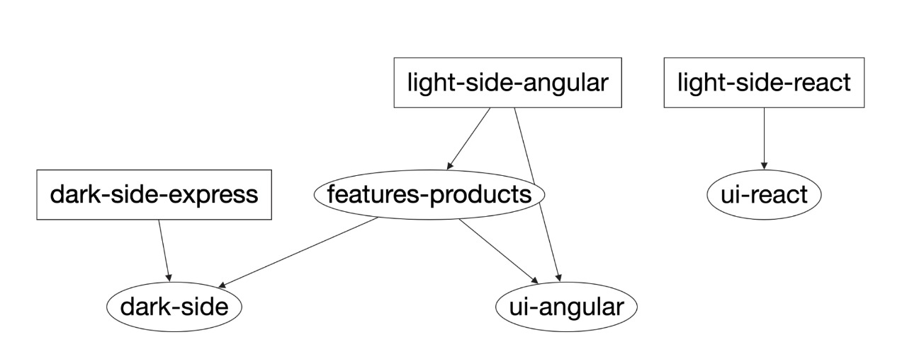

# Full Moon

Let's go to see the full moon tonight!

This is mono repository with frontend and backend technologies JavaScript based

# Index

- [Getting Started](#getting-started)
  - [Prerequisites](#prerequisites)
  - [Installation](#installation)
- [Stack](#stack)

# Getting Started

Get started with the project by running the following commands or you can manually install the dependencies:

```bash
> make getting-started
```

This command install all dependencies necessary to run the project.
And will start backend and frontend servers in your local environment.

After only you have to run the following command to start the servers:

```bash
make run-servers
```

By default servers will be started in the newxt ports:

- Frontend Angular: http://localhost:4200
- Backend Express: http://localhost:3333/api/items

---

## Prerequisites

Make sure all dependencies have been installed before

- [Node.js >= 14](https://nodejs.org/)
- [NPM >= 6](https://www.npmjs.com/)
- [Git](https://git-scm.com/)
- [Nx >= 12.10](https://nx.dev/)

## Installation

1. Install Nx globally or use it with `npx`:

```bash
> npm install -g nx
```

2. Install the dependencies on roor path of the project:

```bash
> npm install
```

3. Running servers:

```bash
nx serve dark-side-express # default port is 3333
nx serve light-side-angular # default port is 4200
```

# Deploy

For generating the production build run the following command:

```bash
make deploy # generate the production build images with docker
```

for re-running container servers via docker run:

```bash
make deploy-start
```

and stop the servers with:

```bash
make deploy-down
```

> Note: view the generated docker images with: `docker images ls`

# Stack



- [Docker](https://www.docker.com/))
- [Node.js](https://nodejs.org/)
- [Express](https://expressjs.com/)
- [NPM](https://www.npmjs.com/)
- [Git](https://git-scm.com/)
- [Commitlint](https://commitlint.js.org/)
- [Nx](https://nx.dev/)
- [Angular >= 12+](https://angular.io/)
- [React](https://reactjs.org/)
- [TypeScript](https://www.typescriptlang.org/)
- [Jest](https://jestjs.io/)
- [Github Actions](https://github.com/Caxvalencia/full-moon/actions)
- [Sass](https://sass-lang.com/)
- [BEM Methodology](http://getbem.com/)
